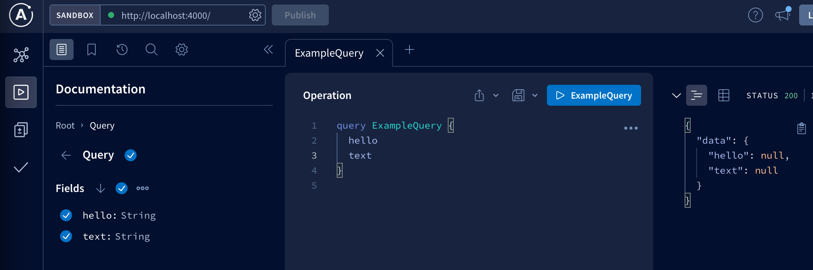
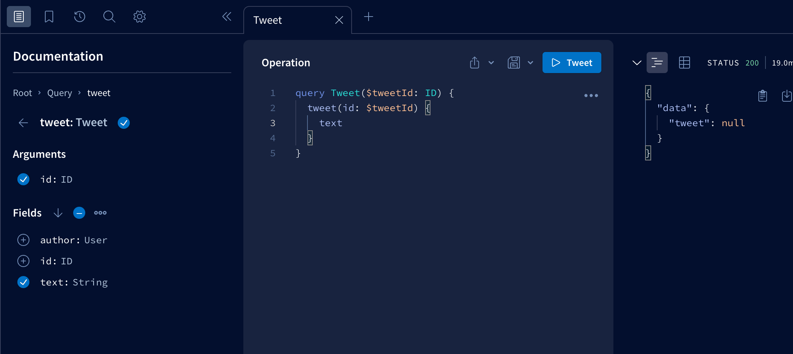
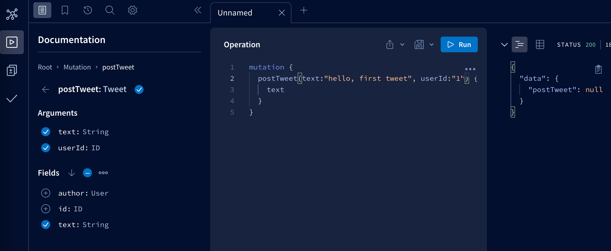

# GraphQL api 만들기

## API란❓

**Application Programming Interface -> 인터페이스이다.**

인터페이스란 무언가와 상호작용 하기위한 버튼이라고 생각하면 쉽다.<br>
리모컨의 버튼은 텔레비전을 만든 사람이 노출시킨 인터페이스이다.<br>
버튼을 조작함으로써 볼륨을 줄이거나 채널을 돌릴 수 있다.

드론의 인터페이스는 tv보다는 조종의 기능만 하기때문에<br>
커맨드(상호작용할 명령어)가 적어 훨씬 간단하다.

<br>

## Rest Api

**rest api는 url로 통신이 이뤄진다.**

`{baseURL}/common/hotels/:id` 등 url을 보고 의도를 이해하기 쉽다는 장점이 있다.<br>
데이터를 post 할때, `{baseURL}/common/create/hotel/` 이런식으로 요청할 것 같지만,<br>
url에는 관행적으로 동사를 쓰지 않는다. <br>
create, add, plus 등 표준적이지 않은 동사를 사용할 수 있기 때문이다.

그 대신 `http메서드`를 이용한다. http의 표준 명세이다.

<br>

## http + rest

`get post delete put` 등의 메서드 + rest 로 사용한다.

<br>

---

## Rest API의 문제점 🪓

#### 1. over fetching

```json
{
  "avatar": {
    "gravatar": {
      "hash": "c9e9fc152ee756a900db85757c29815d"
    }
  },
  "id": 548,
  "iso_639_1": "en",
  "iso_3166_1": "CA",
  "name": "Travis Bell",
  "include_adult": true,
  "username": "travisbell"
  .
  .
  .
}

```

쓰던 말던 너무 많은 데이터를 받는 것.<br>
rest는 선택권 없이 모든 데이터를 받아와야한다. -> 전송시간이 더 오래걸림.

**graphQl을 이용하면 필요한 데이터만 가져올 수 있다.**

<br>

#### 2. under fetching

```json
{
  "movie_id": 548,
  "iso_639_1": "en",
  "iso_3166_1": "CA",
  "movie_name": "harry potter",
  "include_adult": true,
  "username": "travisbell",
  "genreId": [1, 22, 90]
  .
  .
  .
}

```

영화를 화면에 보여주기 위해 데이터를 받아왔다.<br>
genre를 보여주려고 했으나 위 response에는 직접적인 genre_name이 들어있지 않고<br>
genre_id만 있어서 또다른 url에 요청을 해야한다.

사용자에게 보여주기전에 두 url에 요청하는 이러한 방식은 좋지않다.<br>
심지어 3개의 요청을 해야할 수도 있다. -> 로딩 시간이 길어짐.

**graphql은 많은 resource를 한 요청으로 받을 수 있다.**

<br>

## graphQl

graphQl은 restApi의 문제점을 해결해준다.<br>
하나의 specification. 사양, 특성, 명세, 아이디어이기 때문에<br>
js, python, c등 다른 언어로 구현될 수 있다.

graphql을 구현한 서버, `Apollo server`를 사용해 볼 것이다.<br>
express로 만들어진 rest API를 graphql로 바꿔주고 싶다면<br>
서버를 많이 수정하지 않고 미들웨어만 추가시켜주면 된다.

<br>

---

## setting

```
npm init -y
npm i apollo-server graphql
npm i nodemon -D
```

package.json에서

1. script를 dev로 바꿔주고,

2. import 문법을 쓰기위해
   "type": "module"을 해주고 server.js에서 import.

```
npm run dev
```

server.js를 저장할 때 마다 nodemon이 서버를 재시작해준다.

그러나, 이제 아래의 에러발생.

`Error: Apollo Server requires either an existing schema, modules or typeDefs`

`apollo server는 존재하는 schema, modules or typeDefs를 필요로 합니다.`

이제 시작이다.

<br>

---

### graphQl이 data의 shape을 미리 알고 있어야 하기 때문에 나는 에러였다.

```
/api/v1/tweets
/api/v1/users/:id
```

rest api는 많은 url들의 집합이다.

graphQl api는 많은 `type`들의 집합이다.<br>
graphQl server한테 data의 type을 설명해 줘야한다.<br>
(무슨 데이터를 return하는지, 어떤 data를 post할지,.)

**type Query**를 만들어주면 localhost:4000으로 정상 접근 할 수 있다.

<br>

---

### Type Query

graphQl에게 type을 알려주기위해 Schema Definition Language를 쓴다. = SDL <br>

```
GET /text
GET /hello
```

위처럼 rest API에서 GET request url을 노출시키는 것을 graphQl에서는 아래처럼 type Query를 만들어 준다.

사용자가 뭔가를 요청하게 하려면 type Query안에 있어야 한다.

```jsx
const typeDefs = gql`
  type User {
    id: ID
    username: String
  }

  type Tweet {
    id: ID
    text: String
    author: User
  }

  type Query {
    allTweets: [Tweet]
    tweet(id: ID): Tweet
  }
`;
```

## Scalar and Root Types

apollo는 자체적인 studio를 갖고 있어서 graphQl api를 explore 할 수 있게 해준다. <br>
graphQl API와 상호작용하는 graphQl과 비슷한 건데<br>
각종 버튼, 다크모드 등을 지원한다.

`Query your server`를 클릭해 시작해보자.



1. 왜 error가 안뜰까?

2. 왜 null일까?

우선,

```jsx
//graphQl에게 type을 알려주기위해 Schema Definition Language를 쓴다. = SDL

const typeDefs = gql`
  type User {
    id: ID
    username: String
  }

  type Tweet {
    id: ID
    text: String
    author: User
  }

  type Query {
    allTweets: [Tweet]
    tweet(id: ID): Tweet
  }
`;
```

타입을 이렇게 지정해주면, argument를 받을 수 있다.



<br>

### `그래서 scalar type이 뭔데?? `

단 하나의 값만을 저장할 수 있는 데이터 타입.
두 개 이상의 값을 저장할 수 있는 데이터 타입을 컴포지트 타입이라고 한다.

<br>

---

## Mutation Type

GET /api/v1/tweets<br>
POST /api/v1/tweets

rest의 세계에선 위처럼 작성 한다.

GraphQl에선 이런 것들을 Mutation type에 넣어줄 것이다.

```jsx
  type Mutation {
    postTweet(text: String, userId: ID): Tweet
    deleteTweet(id: ID): Boolean
  }
```

user가 backend를 mutate하게 하고 싶거나,<br>
data를 보내게 해서 그걸 backend에 업로드 하고 싶거나<br>
DB를 수정하고 cache를 지우고 logout기능을 작동하게 만들고 싶다면<br>
그게 뭐든 Mutation이라면 Mutation에 넣어줘야 한다.

이딴 식으로 씀.



`POST DELETE PUT` 을 mutation을 사용해 하는 것.

여기까지가 API의 형태를 graphql에 설명하는 부분.<br>
또한, 데이터에 일어날 수 있는 작업들을 설명하는것도.

<br>

---

## Non Nullable Fields

에러는 나지않고 null로 나온다.

```jsx
{
  "data": {
    "tweet": null
  }
}
```

이유는, Tweet이 Nullable field이기 때문.

```jsx

type Query {
    allTweets: [Tweet]
    tweet(id: ID): Tweet
  }

  type Tweet {
    id: ID
    text: String
    author: User
  }

```

graphQl에서는 타입을 위처럼 지정해주면 Tweet이 될수도 있고 null도 될 수 있다.<br>
이것을 nullable field라고 한다.

심지어 tweet의 인자 id도 ID or null 이기 때문에

```jsx
// 이것또한 에러를 내지는 않는다.

{
  tweet {
    text
  }
}
```

그래서 ! 를 붙이면 null은 안되는, required가 된다.

```jsx
type Query {
    allTweets: [Tweet!]!  // 무조건 리스트를 반환하고 무조건 Tweet 타입이어야 함.
    tweet(id: ID!): Tweet  // id가 9071인 유저가 없을 수  있다.
  }


```

여기까지 GraphQl Schema 정의 언어.

<br>

---

## Query Resolvers

누군가 field를 요청했을때 실제로 호출될 함수이다.<br>
args를 풀어서 {id} 로 sorting.<br>
인자를 이용해 데이터를 가져올 수 있다.

```jsx
const resolvers = {
  Query: {
    tweet(root, { id }) {
      return tweets.find((tweet) => tweet.id === id);
    },
  },
};
```

<br>

---

## Relationships

```js
  User: {
    fullName({ firstName, lastName }) {
      return `${firstName} ${lastName}`;
    },
  },

```

resolver의 첫번째 인자는 fullName을 호출하는 Object의 data를 준다.

이 점을 이용해 tweet과 user들을 연결할 수 있다.

```json
{
  allTweets {
    id
    text
    author {
      fullName
    }
  }
}

결과.
{
  "data": {
    "allTweets": [
      {
        "id": "1",
        "text": "first",
        "author": {
          "fullName": "heyho yo"
        }
      },
      {
        "id": "2",
        "text": "second",
        "author": {
          "fullName": "harry s"
        }
      }
    ]
  }
}
```

<br>

---
